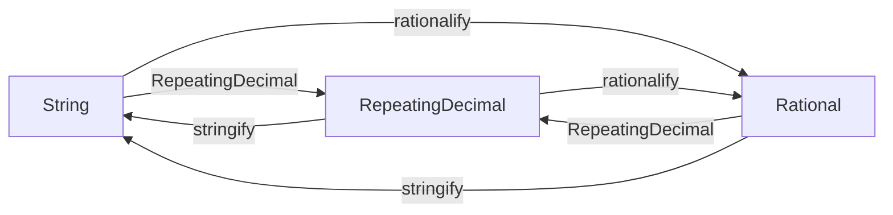

# トロトロのイントロ
Juliaで循環小数を扱うための[`RepeatingDecimalNotations.jl`](https://github.com/hyrodium/RepeatingDecimalNotations.jl)パッケージを作りました！

↓↓以下のように使えます↓↓

```julia
julia> using RepeatingDecimalNotations

julia> using RepeatingDecimalNotations: stringify, rationalify

julia> r = rd"123.4(56)"  # 123.4565656...
61111//495

julia> rd"1.234r56e2"  # 他の記法も
61111//495

julia> rd"123.45656..."  # 使えます！
61111//495

julia> float(r)  # 浮動小数点に変換して確認
123.45656565656566

julia> rd"0.(9)"  # 0.999... は 1 に等しく
1//1

julia> rd"0.99(9)", rd"1", rd"1.000_000"  # 記法は非一意的
(1//1, 1//1, 1//1)

julia> stringify(1//7)  # `Rational`から`String`への変換
"0.(142857)"

julia> rationalify("0.1(6)")  # 逆向きの変換
1//6
```

# デザイン

## 循環小数を表せる型たち
3つの循環小数を表せる型があります。
`Base`出身の`String`と`Rational`、それと本パッケージで定義している`RepeatingDecimal`です。

* `Rational{T}`
    * 分母分子をそれぞれ`T<:Real`として保持します。
    * 表現は一意的です。(約分されている場合)
    * e.g. `4111111//33300`
* `String`
    * 文字列として循環小数を表します。
    * 表現は非一意的。
    * e.g. `"123.45(678)"`, `"123.456(786)"`, `"123.456_786_786(786_786)"`
* `RepeatingDecimal`
    * 符号`sign::Bool`, 有限部分`finite_part::BigInt`, 循環部分`repeat_part::BigInt`, 小数点位置`point_position::Int`, 循環部分長`period::Int`を保持します.
    * こちらも表現は非一意的。
    * e.g. `RepeatingDecimal(true, 12345, 678, 2, 3)`, `RepeatingDecimal(true, 123456, 786, 3, 3)`, `RepeatingDecimal(true, 123456_786_786, 786_786, 9, 6)`

```julia
julia> using RepeatingDecimalNotations

julia> RepeatingDecimal(true, 12345, 678, 2, 3)
       2|--|---|3
    +123.45(678)
----------- --------------
Finite part Repeating part

julia> RepeatingDecimal(true, 123456, 786, 3, 3)
      3|---|---|3
   +123.456(786)
----------- --------------
Finite part Repeating part

julia> RepeatingDecimal(true, 123456_786_786, 786_786, 9, 6)
   9|---------|------|6
+123.456786786(786786)
-------------- --------------
   Finite part Repeating part
```

## 変換用の関数: `stringify`, `rationalify`



* Type piracyを避けるために`Base.string`や`Base.rationalize`にメソッド追加するのは避けました。
* そのために新しい関数`stringify`, `rationalify`を用意しています。
* これらの関数の名前は循環小数に関連しない命名になっているので、あえてエクスポートしていません。以下のように明示的に指定して使ってください。
    * `RepeatingDecimalNotations.stringify(...)`
    * `import RepeatingDecimalNotations: stringify`
    * `using RepeatingDecimalNotations: stringify`

```julia
julia> using RepeatingDecimalNotations

julia> using RepeatingDecimalNotations: stringify, rationalify

julia> str = "123.45(678)"
"123.45(678)"

julia> rd = RepeatingDecimal(true,12345,678,2,3)
       2|--|---|3
    +123.45(678)
----------- --------------
Finite part Repeating part

julia> r = 4111111//33300
4111111//33300

julia> str == stringify(rd) == stringify(r)
true

julia> rd == RepeatingDecimal(str) == RepeatingDecimal(r)
true

julia> r == rationalify(str) == rationalify(rd)
true
```

## `RepeatingDecimalNotation`の部分型
これらの型が循環小数の表記スタイルを表しています。

```julia
julia> subtypes(RepeatingDecimalNotation)
3-element Vector{Any}:
 EllipsisNotation
 ParenthesesNotation
 ScientificNotation
```


### `ParenthesesNotation` (デフォルト)
$$
123.45(678)
$$

```julia
julia> rd"123.45(678)"
4111111//33300

julia> no = ParenthesesNotation()
ParenthesesNotation()

julia> stringify(no, 1//11)
"0.(09)"

julia> rationalify(no, "123.45(678)")
4111111//33300
```

### `ScientificNotation`
$$
1.2345\text{r}678\text{e}2
$$

```julia
julia> rd"123.45r678"
4111111//33300

julia> no = ScientificNotation()
ScientificNotation()

julia> stringify(no, 1//11)
"0.r09"

julia> rationalify(no, "123.45r678")
4111111//33300

julia> rd"1.2345r678e2"  # 指数表記もOK
4111111//33300
```

### `EllipsisNotation`
$$
123.45678678...
$$

```julia
julia> rd"123.45678678..."
4111111//33300

julia> no = EllipsisNotation()
EllipsisNotation()

julia> stringify(no, 1//11)
"0.0909..."

julia> rationalify(no, "123.45678678...")
4111111//33300

julia> rd"0.4545..."      # 0.(45)と同じ。 [45]の2回繰り返し
5//11

julia> rd"0.333..."       # 0.(3)と同じ。 [3]の3回繰り返し
1//3

julia> rd"0.13331333..."  # 0.(1333)と同じ。 [1333]の2回繰り返しは[3]の3回繰り返しより優先される
1333//9999

julia> rd"0.133313333..." # 0.13331(3)と同じ。 末尾に[3]を追加して曖昧さを解消できる
19997//150000
```

# アウアウッ アウトロ

* 今後の開発方針
  * Generalに登録
  * `DotsNotation`のサポート追加
* 感想
  * Juliaのドキュメントシステムは素晴らしく、良いドキュメントが直感的に書けて良いですね。
  * Juliaのテストシステムは素晴らしく、良いテストが直感的に書けて良いですね。
